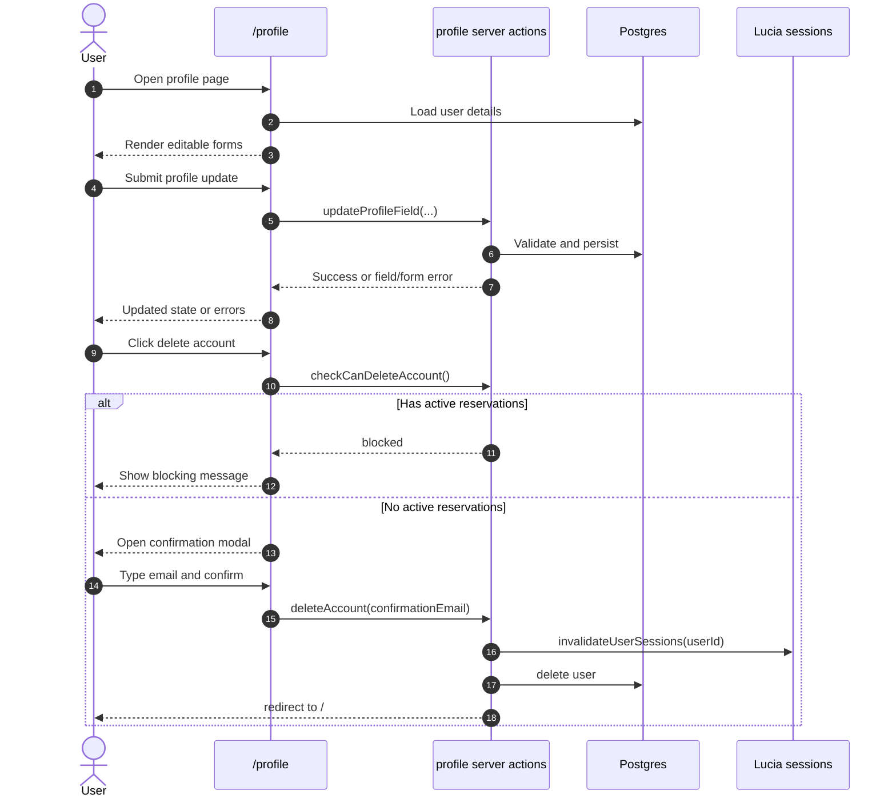

# Profile Page

## Overview

Build a logged-in profile page where hikers and cottage owners can maintain their Napmmit account details: email, name, and phone. Users can also permanently delete their account when they have no active reservations, using a confirmation modal that requires typing their email address.

Reference: `docs/profile-page-plan.md`.

## Goal

Give every authenticated user a single place to view and update the personal details tied to their Napmmit account, and to delete the account when it is safe to do so.

## Scope

- Extend the existing `/profile` page with editable profile fields.
- Add server actions for updating email, name (`username`), and phone (`phoneNumber`).
- Add account deletion with an active-reservation guard and typed-email confirmation modal.
- Reuse existing auth patterns (`validateRequest`, Lucia sessions, email verification flow).
- Add Slovak translations for all new profile UI copy.
- Add focused unit tests for validation, active-reservation checks, and deletion guards.

## Out Of Scope

- Password change on the profile page (use existing reset-password flow).
- Profile photo or avatar upload.
- Google/OAuth account linking.
- Admin impersonation or admin-managed user editing.
- Changing user role from the profile page.
- Cottage-owner-specific cottage management from the profile page.
- Email notification when profile fields change (except the existing verification email on email change).

## Current State

- Route exists at `src/app/profile/page.tsx`.
- Page requires authentication and redirects unauthenticated visitors to `/login`.
- Page currently renders only a title and description (`Profile.Title`, `Profile.Description` in `messages/sk.json`).
- Nav header already links the logged-in user's email to `ROUTES.PROFILE` (`src/components/nav-header/index.tsx`).
- User model fields in `src/server/db/schema.ts`: `email`, `username`, `phoneNumber`, `isEmailVerified`, `role`.
- Lucia session user attributes expose `email` and `username` but not `phoneNumber`; profile data must be loaded from the database on the server.

## User Flow

### View And Edit Profile

1. Logged-in user opens `/profile` from the nav header or direct URL.
2. Server loads the current user's `email`, `username`, and `phoneNumber`.
3. User edits one or more fields and submits the relevant form section.
4. Server validates input, applies the update, and returns field or form errors.
5. On success, the page reflects the updated values.

### Change Email

1. User enters a new email address on the profile page.
2. Server checks that the email is valid and not already taken by another user.
3. Server updates the user's email and sets `isEmailVerified` to `false`.
4. Server generates and sends a verification code using the existing email-verification pipeline.
5. User is redirected to `/verify-email` (or sees inline guidance to verify) before the new email is considered confirmed.

### Delete Account

1. User clicks "Delete account" in a danger zone section.
2. If the user has active reservations, deletion is blocked and an explanatory message is shown.
3. Otherwise, a confirmation modal opens.
4. User must type their current email address exactly to enable the destructive confirm button.
5. On confirm, the server deletes the user, invalidates all sessions, and redirects to `/`.



## Functional Requirements

### Profile Page UI

Extend `src/app/profile/page.tsx` and extract client forms as needed.

Requirements:

- Keep the page as a server component that loads the authenticated user from the database.
- Show three editable sections:
  - **Email** — current value, new email input, submit button.
  - **Name** — maps to `users.username`.
  - **Phone** — maps to `users.phoneNumber`.
- Use existing form primitives: `Input`, `Label`, `SubmitButton`, `Card` or equivalent layout used elsewhere in auth pages.
- Display field-level and form-level errors returned from server actions.
- Show email verification status when `isEmailVerified` is `false` (link or copy pointing to `/verify-email`).
- Add a visually distinct **Danger zone** section for account deletion at the bottom of the page.
- Match existing Napmmit spacing, typography, and Slovak-first copy patterns.

Suggested file layout:

- `src/app/profile/page.tsx` — server page shell
- `src/components/profile/profile-details-form.tsx` — client form for name and phone
- `src/components/profile/profile-email-form.tsx` — client form for email change
- `src/components/profile/delete-account-section.tsx` — danger zone + confirmation modal

### Validation

Add `src/lib/validators/profile.ts` with Zod schemas, for example:

```ts
export const updateUsernameSchema = z.object({
  username: z.string().trim().min(1).max(50),
});

export const updatePhoneNumberSchema = z.object({
  phoneNumber: z.string().trim().min(1).max(20),
});

export const updateEmailSchema = z.object({
  email: z.email(),
});

export const deleteAccountSchema = z.object({
  confirmationEmail: z.email(),
});
```

Requirements:

- Reuse `Shared.EmailField` translation keys where possible.
- Trim string inputs before validation.
- Reject empty name and phone values.
- Enforce the same max lengths as the database schema (`username` 50, `phoneNumber` 20, `email` 100).

### Server Actions

Add `src/lib/profile/actions.ts` (or extend `src/lib/auth/actions.ts` if preferred for cohesion).

Use the existing `ActionResponse<T>` pattern from auth actions.

#### `updateUsername`

- Require authenticated user via `validateRequest()`.
- Validate with `updateUsernameSchema`.
- Update `users.username` and `users.updatedAt`.
- Return field errors on validation failure.

#### `updatePhoneNumber`

- Require authenticated user.
- Validate with `updatePhoneNumberSchema`.
- Update `users.phoneNumber` and `users.updatedAt`.

#### `updateEmail`

- Require authenticated user.
- Validate with `updateEmailSchema`.
- Reject if the new email equals the current email.
- Reject if another user already has the email.
- In a transaction:
  - Update `users.email` to the new value.
  - Set `users.isEmailVerified` to `false`.
  - Update `users.updatedAt`.
- Generate and send verification code via existing `generateEmailVerificationCode()` and `sendMail()` helpers.
- Invalidate existing sessions and create a new session for the user (same pattern as `verifyEmail` reversal path), or redirect to `/verify-email` after update.
- Redirect to `ROUTES.AUTH.VERIFY_EMAIL` on success.

#### `getActiveReservationCount` (helper or inline query)

Define **active reservation** consistently with availability logic in `src/lib/reservation/actions.ts`:

- Reservation `status` is `pending` or `confirmed`.
- Scoped to reservations where `reservations.userId` equals the current user's id.

#### `deleteAccount`

- Require authenticated user.
- Validate `confirmationEmail` with `deleteAccountSchema`.
- Require exact case-insensitive match between `confirmationEmail` and the user's current email.
- Block deletion when the user has one or more active reservations (see definition above).
- Block deletion when the user is a cottage owner who still owns one or more cottages (`cottages.userId = current user`). Deleting the user would cascade-delete owned cottages and their reservations; this must not be allowed from self-service profile deletion.
- On success:
  - Call `lucia.invalidateUserSessions(user.id)`.
  - Delete the user row from `users` (relying on existing FK cascades only where safe; owned cottages must be blocked beforehand).
  - Clear the session cookie.
  - Redirect to `/`.

Return typed error codes/messages for:

- `confirmation_mismatch`
- `active_reservations`
- `owned_cottages`
- generic failure

### Delete Account Confirmation Modal

Use `src/components/ui/alert-dialog.tsx`.

Requirements:

- Triggered from the danger zone, not immediate deletion.
- Modal copy explains that deletion is permanent.
- Text input for the user to type their email address.
- Destructive confirm button stays disabled until the typed value matches the current email exactly (client-side UX); server still re-validates.
- Cancel closes the modal without side effects.
- Show server-side blocking reason if deletion fails after submit.

### Data And Auth Notes

- `users.username` is the display name field; signup currently initializes it to `''` and `phoneNumber` to `''`.
- `reservations.userId` is nullable and has no `onDelete` cascade from users; deleting a user should either null out linked reservations or be blocked when active reservations exist. Prefer **blocking** deletion when active reservations exist rather than orphaning in-flight bookings.
- `cottages.userId` uses `onDelete: 'cascade'`; cottage owners with cottages must be blocked from self-deletion.
- Nav header shows `user.email` from the Lucia session; after email change and re-login/session refresh, the header should show the updated email.

## Translations

Extend `messages/sk.json` under a `Profile` namespace. Minimum keys:

- Section titles for email, name, phone, and danger zone
- Field labels and placeholders (reuse `Shared` keys where possible)
- Submit/save button labels per section
- Success toasts or inline success messages
- Email-not-verified warning and link text
- Delete account button, modal title, modal description, confirmation input label/placeholder
- Error messages for blocked deletion (active reservations, owned cottages, confirmation mismatch)
- Generic save/update failure copy

## Testing

Add focused unit tests, for example:

- `src/lib/validators/profile.test.ts` — schema edge cases (empty, too long, invalid email).
- `src/lib/profile/active-reservations.test.ts` — active reservation detection (`pending`, `confirmed` count; `cancelled`, `completed` ignored).
- `src/lib/profile/delete-account.test.ts` — confirmation email matching, block when active reservations exist, block when user owns cottages.

Mock database calls following existing test patterns in `src/lib/reservation/*.test.ts`.

## Manual Verification

1. Log in as a hiker with no active reservations.
2. Open `/profile` and confirm current email, name, and phone are shown.
3. Update name and phone; verify persistence after refresh.
4. Change email; confirm verification email is sent and user must verify again.
5. Attempt account deletion without typing email — confirm button stays disabled.
6. Type wrong email — confirm button stays disabled or server rejects.
7. Type correct email and confirm — account is deleted and user is logged out.
8. Log in as a hiker with a `pending` or `confirmed` reservation — deletion is blocked with a clear message.
9. Log in as a cottage owner with at least one cottage — deletion is blocked.
10. Confirm nav header email link still routes to `/profile`.
11. Run `bun lint-format` and `bun build`.

## Acceptance Criteria

- `/profile` is accessible only to authenticated users.
- Users can update email, name (`username`), and phone (`phoneNumber`) from the profile page.
- Email change triggers re-verification and prevents treating the new address as verified until the code is entered.
- Account deletion requires a confirmation modal and exact email confirmation text.
- Account deletion is blocked when the user has active (`pending` or `confirmed`) reservations.
- Account deletion is blocked for cottage owners who still own cottages.
- Successful deletion logs the user out and redirects to `/`.
- Slovak translations cover all new UI strings.
- Focused unit tests pass locally.
- `bun lint-format` passes.
- `bun build` passes.

## Implementation Notes

- Prefer server actions over a new API route; this matches auth and reservation mutation patterns.
- Keep the page server-rendered; only form sections and the delete modal need `'use client'`.
- Email change should reuse `generateEmailVerificationCode`, `sendMail`, and `/verify-email` rather than inventing a parallel verification flow.
- Align "active reservation" with `pending | confirmed` as used in availability queries — do not invent a separate definition.
- Consider showing the user's role read-only on the profile page only if useful; do not allow role switching here.
- After non-email profile updates, a simple page refresh or optimistic success message is sufficient; no extra email is required.
- Remove the `TODO: add the profile page` comment in `src/components/nav-header/index.tsx` once the page is implemented.

## Open Decisions

- Whether name/phone updates should use one combined form or separate save actions per section. Separate sections match the plan and keep email verification isolated.
- Whether to show a success toast or inline banner after name/phone updates. Follow existing auth form feedback patterns (`toast` vs inline errors).
- Whether cancelled-but-upcoming reservations should block deletion. Current spec follows active = `pending | confirmed` only; revisit if product wants stricter rules.
