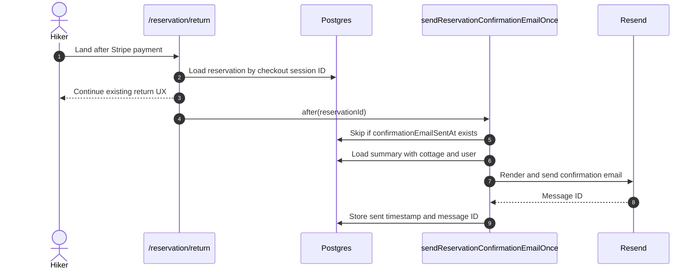

# Reservation Confirmed Flow Phase 1: Confirmation Email

## Overview

Add background reservation confirmation email delivery after Stripe payment succeeds. This phase builds the shared reservation summary data shape, email idempotency tracking, and the send-once email pipeline. The return page can schedule the email when a paid reservation exists, even before Phase 2 replaces the dashboard redirect with the confirmation page.

Reference: `docs/reservation-confirmed-flow-plan.md`.

## Goal

After the webhook creates a paid `pending` reservation, Napmmit should send exactly one confirmation email to the hiker with the same reservation summary fields that will later appear on the confirmation page and PDF. The email must send in the background without blocking the browser response.

## Scope

- Add confirmation email tracking columns to the reservations schema and generate a Drizzle migration.
- Create a shared `ReservationConfirmationSummary` type and query helpers.
- Implement idempotent `sendReservationConfirmationEmailOnce()`.
- Expand the existing `ReservationCreatedEmail` template to render the full summary.
- Schedule email sending from `/reservation/return` using `after()` when the reservation exists.
- Add Slovak translations for the expanded email content.
- Add focused unit tests for summary formatting, recipient resolution, and email idempotency.

## Out Of Scope

- Confirmation page UI and removal of the dashboard redirect.
- PDF generation and download route.
- Owner status-change emails (`confirmed` / `cancelled` by cottage owner).
- Sending email from the Stripe webhook.
- Durable background job or queue for email retries.
- Production Resend domain/DNS setup beyond existing project configuration.

## User Flow

1. Hiker completes Stripe payment.
2. Stripe webhook creates a paid `pending` reservation.
3. Browser lands on `/reservation/return?session_id=...`.
4. Return page detects `reservation_created` (existing behavior may still redirect to dashboard).
5. Before or alongside the response, the server schedules `sendReservationConfirmationEmailOnce(reservationId)` via `after()`.
6. Email service renders the React Email template and sends via Resend.
7. Database records `confirmationEmailSentAt` and provider message ID.
8. Page refresh, polling retries, or duplicate webhook events do not send duplicate emails.



## Functional Requirements

### Database: Email Tracking

Modify `src/server/db/schema.ts` and generate a Drizzle migration.

Add to `reservations`:

- `confirmationEmailSentAt`
- `confirmationEmailMessageId`
- `confirmationEmailFailedAt`

Why:

- Return page refreshes and polling can call the same path multiple times.
- Stripe webhooks can be retried.
- Email sending must happen once per reservation unless manually retried later.

Optional stronger idempotency for later:

- `confirmationEmailSendingAt`

### Shared Reservation Summary

Create `src/lib/reservation/summary.ts`.

Define `ReservationConfirmationSummary` with:

- reservation identity: `id`, `accessToken`, `status`, `paymentStatus`
- stay details: `from`, `to`, `nights`, `bedsReserved`
- pricing: `pricePerNight`, `accommodationTotal`, `reservationFeeCents`, `grandTotal`
- cottage contact: `name`, `address`, `email`, `phoneNumber`, `website`
- guest contact: `name`, `email`, `phoneNumber`, `isLoggedIn`

Required functions:

- `getReservationConfirmationSummaryByCheckoutSession(checkoutSessionId)`
- `getReservationConfirmationSummaryByAccessToken(accessToken)` — needed by Phase 2 PDF; implement now so email and page share one query layer
- `getReservationPriceBreakdown(summary)`

Implementation notes:

- Keep date parsing consistent with `src/lib/reservation-date-range.ts`.
- Use `differenceInDays()` for nights, matching `reservation-section.tsx`.
- Treat `totalPrice` as accommodation total.
- Show `reservationFeeCents / 100` as the paid Napmmit reservation fee.
- Resolve guest contact from `users.email` / `users.phoneNumber` when `reservation.userId` exists.
- Use `guestEmail` / `guestPhone` for anonymous reservations.

### Confirmation Email Coordinator

Create `src/lib/reservation/confirmation.ts`.

Export:

```ts
export async function sendReservationConfirmationEmailOnce(
  reservationId: number,
): Promise<{ success: true } | { error: string }>;
```

Requirements:

1. Load reservation with user and cottage.
2. If `confirmationEmailSentAt` exists, return success without sending.
3. Resolve recipient:
   - logged-in hiker: `reservation.user.email`
   - anonymous hiker: `reservation.guestEmail`
4. If no email recipient exists, no-op or mark `confirmationEmailFailedAt` with a clear reason and log.
5. Build `ReservationConfirmationSummary`.
6. Render email via existing `sendMail()` pipeline.
7. On success, store `confirmationEmailSentAt` and provider message ID.
8. On failure, store `confirmationEmailFailedAt` and log for follow-up.

Concurrency note:

- MVP idempotency is acceptable for page refreshes.
- Prefer a simple claim-then-send pattern if duplicate sends become a concern.

### Email Template

Modify `src/lib/emailTemplates/reservation-created.tsx`.

The existing template renders a minimal pending-reservation message. Expand it to use `ReservationConfirmationSummary`.

Add:

- reservation status with copy that payment is confirmed but owner approval may still be pending
- date range and nights
- beds reserved
- accommodation price calculation
- reservation fee
- grand total / paid summary
- cottage contact details
- hiker contact details
- dashboard link when `summary.guest.isLoggedIn`
- PDF link when `summary.accessToken` is present (URL can point to the future Phase 2/3 route)

Recommended props:

```ts
type Props = {
  summary: ReservationConfirmationSummary;
  dashboardUrl?: string;
  pdfUrl?: string;
  locale?: string;
};
```

Copy rules:

- "Payment confirmed" means Stripe payment succeeded.
- "Reservation created" means Napmmit saved the reservation.
- `status === 'pending'` means the cottage owner still needs to approve.
- Do not say "owner-confirmed" until `status === 'confirmed'`.

### Return Page Email Trigger

Modify `src/app/reservation/return/page.tsx`.

When `paymentStatus.status === 'reservation_created'`:

- Load the reservation ID from payment status or summary query.
- Schedule background email:

```tsx
import { after } from 'next/server';

after(() => sendReservationConfirmationEmailOnce(summary.id));
```

Phase 1 may keep the existing dashboard redirect. The important requirement is that email sending is wired and idempotent before Phase 2 changes the visible page content.

### Translations

Modify `messages/sk.json`.

Expand `EmailTemplates.ReservationCreated` with strings for:

- payment confirmed state
- pending owner confirmation state
- price breakdown labels
- cottage contact labels
- hiker contact labels
- dashboard CTA
- PDF CTA placeholder copy

## Suggested Files

- `src/server/db/schema.ts`
- Drizzle migration file
- `src/lib/reservation/summary.ts`
- `src/lib/reservation/confirmation.ts`
- `src/lib/emailTemplates/reservation-created.tsx`
- `src/app/reservation/return/page.tsx`
- `messages/sk.json`
- Unit test files colocated with tested modules

## Unit Test Requirements

Minimum coverage:

- Summary price breakdown:
  - one-night reservation
  - multi-night reservation
  - multiple beds
  - reservation fee cents conversion
- Recipient resolution:
  - logged-in hiker uses `user.email`
  - anonymous hiker uses `guestEmail`
  - phone-only anonymous reservation does not attempt email
- Email idempotency:
  - no send when `confirmationEmailSentAt` is already set
  - marks sent after successful Resend response
  - marks failed/logs on send failure

Use mocks for `sendMail()` and database access where needed.

## Manual Test Checklist

Using Stripe CLI:

```bash
stripe listen --forward-to localhost:3000/api/stripe/webhook
```

Check:

- completed payment creates exactly one paid pending reservation
- confirmation email sends once for logged-in hiker
- confirmation email sends once for anonymous hiker with email
- phone-only anonymous reservation skips email with a clear log
- refreshing the return page does not send duplicate emails
- duplicate `checkout.session.completed` does not duplicate reservations or emails
- email content includes dates, status, beds, price calculation, cottage contact, and hiker contact

## Acceptance Criteria

- Confirmation email tracking columns exist in schema and migration.
- `ReservationConfirmationSummary` is the single source for email content fields.
- `sendReservationConfirmationEmailOnce()` is idempotent per reservation.
- Expanded `ReservationCreatedEmail` renders the full summary.
- Return page schedules email in the background via `after()`.
- Email sending does not block the HTTP response.
- Slovak email translations are present.
- Focused unit tests pass locally.
- `bun lint-format` passes.
- `bun build` passes.

## Implementation Notes

- Recommended MVP trigger location is the return page, not the webhook.
- This keeps webhook acknowledgment fast and matches "show response first, email in background".
- Tradeoff: if a hiker pays but never returns to the site, the confirmation email may not send. A durable queue can be added later.
- Reuse existing `src/server/db/sendMail.ts`, `resend`, and `@react-email/*` dependencies.
- Phase 2 will reuse the same summary module for the confirmation page UI.
