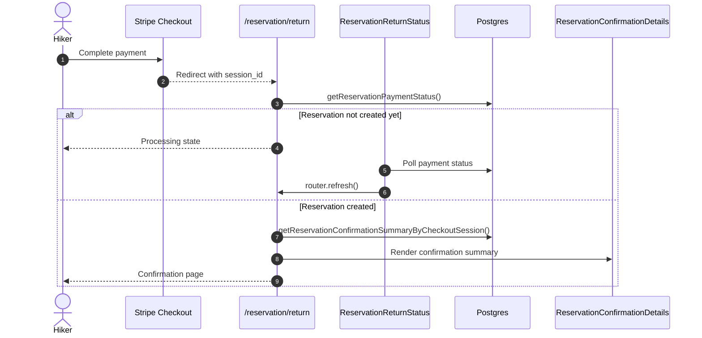
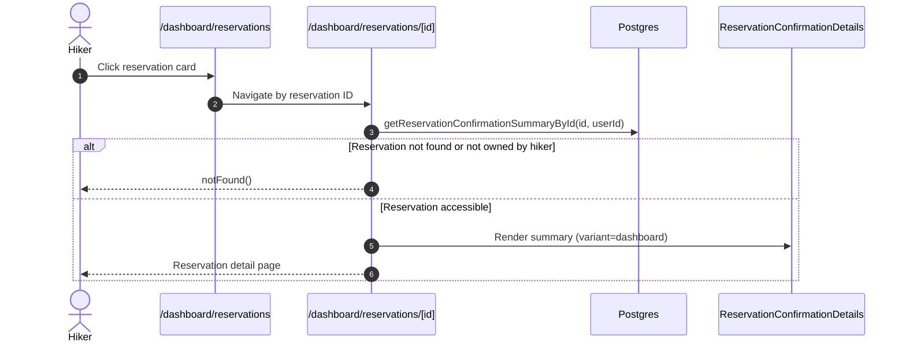

# Reservation Confirmed Flow Phase 2: Confirmation Page

## Overview

Replace the post-payment dashboard redirect with a dedicated reservation confirmation page on `/reservation/return`. This phase renders the shared reservation summary in the browser, updates polling behavior, and keeps background email scheduling from Phase 1. The same summary UI is reused on `/dashboard/reservations/[id]` when hikers open a reservation from their dashboard list.

Reference: `docs/reservation-confirmed-flow-plan.md`.

Depends on: `context/features/reservation-confirmed-phase-1-email-spec.md`.

## Goal

After Stripe confirms payment and the webhook creates the paid reservation, hikers should see a confirmation page with the full reservation summary instead of being redirected to the dashboard. Logged-in hikers get a dashboard CTA; anonymous hikers see copy that confirmation was sent to their provided contact details.

The same reservation summary UI (`ReservationConfirmationDetails`) is also the hiker reservation detail page in the dashboard. Clicking a reservation card on `/dashboard/reservations` opens that reservation by ID.

## Scope

- Extend payment status helpers with reservation metadata needed for rendering.
- Create the confirmation page UI component and optional shared price breakdown UI.
- Change `/reservation/return` to render the confirmation page when the reservation exists.
- Change polling success behavior from dashboard redirect to `router.refresh()`.
- Reuse `ReservationConfirmationDetails` on a dashboard reservation detail route loaded by reservation ID.
- Link hiker reservation cards on `/dashboard/reservations` to the reservation detail route.
- Add Slovak translations for the confirmation page and dashboard detail view.
- Add focused unit tests for payment status states.

## Out Of Scope

- Confirmation email pipeline and template changes (Phase 1).
- PDF generation, PDF document component, and `/reservation/[accessToken]/confirmation.pdf` route.
- Owner status-change emails when cottage owners confirm or cancel reservations.
- Owner reservation detail page or linking owner reservation cards (hiker-only in this phase).
- Changing the Stripe webhook or payment creation flow.
- Durable email queue or retry system.

## User Flow

1. Hiker completes Stripe payment.
2. Stripe redirects to `/reservation/return?session_id={CHECKOUT_SESSION_ID}`.
3. If the webhook has not finished, the page shows the existing processing/polling state.
4. Once the reservation exists, polling calls `router.refresh()` instead of redirecting.
5. The server component loads `ReservationConfirmationSummary` and renders the confirmation page.
6. Phase 1 background email scheduling still runs via `after()`.
7. Logged-in hikers can navigate to dashboard reservations; anonymous hikers see contact-based follow-up copy.

### Dashboard Reservation Detail Flow

1. Logged-in hiker opens `/dashboard/reservations`.
2. Hiker clicks a reservation card.
3. App navigates to `/dashboard/reservations/[id]`.
4. Server loads `ReservationConfirmationSummary` by reservation ID with ownership check.
5. Server renders the same `ReservationConfirmationDetails` component in dashboard variant.
6. Hiker can return to the reservations list from the detail page.





## Functional Requirements

### Payment Status Helper

Modify `src/lib/reservation/payment-status.ts`.

Extend `ReservationPaymentStatus` to return enough data for rendering and linking:

```ts
export type ReservationPaymentStatus =
  | { status: 'missing_session' }
  | { status: 'not_found' }
  | {
      status: 'reservation_created';
      reservationId: number;
      reservationStatus: ReservationStatusType;
      paymentStatus: PaymentStatusType;
      accessToken: string | null;
    };
```

Requirements:

- `missing_session` when `session_id` is absent.
- `not_found` when no reservation exists yet for the checkout session.
- `reservation_created` when the webhook-created reservation exists.

### Return Page

Modify `src/app/reservation/return/page.tsx`.

Replace dashboard redirect with server-rendered confirmation content.

Behavior:

- Missing `session_id`: show existing missing payment state.
- `not_found`: render `ReservationReturnStatus` polling component.
- `reservation_created`:
  - load `ReservationConfirmationSummary` by checkout session ID
  - `notFound()` if summary is unexpectedly missing
  - keep `after(() => sendReservationConfirmationEmailOnce(summary.id))` from Phase 1
  - render `ReservationConfirmationDetails`

Remove:

```tsx
if (paymentStatus.status === 'reservation_created') {
  redirect(ROUTES.DASHBOARD.RESERVATIONS);
}
```

### Polling Client

Modify `src/app/reservation/return/reservation-return-status.tsx`.

Change success handling from dashboard redirect to page refresh:

```tsx
if (status.status === 'reservation_created') {
  router.refresh();
  return;
}
```

This lets the server component render the confirmation page using the same `session_id`.

### Confirmation Page Component

Create `src/components/reservation/reservation-confirmation-details.tsx`.

Render `ReservationConfirmationSummary`.

The component is shared by:

- `/reservation/return` after successful payment (`variant="post_payment"`)
- `/dashboard/reservations/[id]` when a logged-in hiker opens a reservation (`variant="dashboard"`)

Include:

- reservation status badge showing pending owner confirmation when `status === 'pending'`
- date range
- nights count
- beds reserved
- accommodation price calculation
- reservation fee
- total/paid summary
- cottage contact card
- hiker contact card
- PDF download button placeholder only if Phase 3 is deferred; otherwise omit until PDF route exists

Variant-specific header and actions:

| Element | `post_payment` | `dashboard` |
| --- | --- | --- |
| Success banner ("Platba bola potvrdená") | show | hide |
| Page title | "Rezervácia bola prijatá" or equivalent | reservation detail title (e.g. cottage name or "Detail rezervácie") |
| Primary action | dashboard CTA for logged-in users; anonymous follow-up copy otherwise | back link/button to `ROUTES.DASHBOARD.RESERVATIONS` |
| Secondary action | back home | optional back home or omit |

Example structure:

```tsx
type ReservationConfirmationDetailsProps = {
  summary: ReservationConfirmationSummary;
  variant?: 'post_payment' | 'dashboard';
};

export function ReservationConfirmationDetails({
  summary,
  variant = 'post_payment',
}: ReservationConfirmationDetailsProps) {
  return (
    <main className="mx-auto max-w-3xl px-6 py-12">
      <section className="rounded-lg border bg-white p-6 shadow-xs">
        {/* variant-specific heading, summary rows, contact blocks, actions */}
      </section>
    </main>
  );
}
```

Post-payment link behavior:

- If `summary.guest.isLoggedIn`, show primary button to `ROUTES.DASHBOARD.RESERVATIONS`.
- If anonymous, hide dashboard button and show copy that confirmation was sent to the provided email/phone.

Dashboard variant behavior:

- Assume authenticated hiker context.
- Do not show payment-confirmed banner or anonymous follow-up copy.
- Show a clear back navigation control to the reservations list.

Reuse existing UI patterns from dashboard reservation cards where practical.

### Reservation Summary By ID

Extend `src/lib/reservation/summary-queries.ts`.

Add:

```ts
export async function getReservationConfirmationSummaryById(
  reservationId: number,
  userId: string,
): Promise<ReservationConfirmationSummary | null>;
```

Requirements:

- Reuse the existing `reservationSummaryQuery` shape and `mapReservationToConfirmationSummary()`.
- Return `null` when the reservation does not exist.
- Return `null` when the reservation exists but does not belong to the requesting hiker (`reservation.userId !== userId`).
- Do not expose reservations to other users through ID guessing.

Export from `src/lib/reservation/summary.ts` alongside the checkout-session and access-token helpers.

### Dashboard Reservation Detail Route

Create `src/app/dashboard/reservations/[id]/page.tsx`.

Behavior:

- Require authenticated user via existing dashboard auth pattern.
- Parse numeric reservation ID from route params; invalid IDs call `notFound()`.
- Load summary with `getReservationConfirmationSummaryById(id, user.id)`.
- Call `notFound()` when summary is missing or inaccessible.
- Render `ReservationConfirmationDetails` with `variant="dashboard"`.

Suggested route constant:

```ts
ROUTES.DASHBOARD.RESERVATION_DETAIL: (id: number) =>
  `/dashboard/reservations/${id}`,
```

This phase scopes dashboard detail access to hikers viewing their own reservations. Owner reservation cards remain unchanged unless a follow-up explicitly adds an owner detail view.

### Dashboard Reservation Card Link

Modify `src/app/dashboard/reservations/hiker-reservation-card.tsx`.

Requirements:

- Make the card navigable to `/dashboard/reservations/[id]`.
- Prefer linking the card body/title area while keeping cancel action as a separate button click target.
- Use `ROUTES.DASHBOARD.RESERVATION_DETAIL(reservation.id)` for the href.
- Preserve existing cancel behavior and disabled state for cancelled reservations.

Suggested pattern:

- Wrap card header/content in `Link`, or make the card title a link.
- Keep the cancel button in `CardFooter` outside the link so action clicks do not trigger navigation.

### Optional Shared Price Breakdown UI

Create `src/components/reservation/reservation-price-breakdown.tsx` if the price block is non-trivial.

Purpose:

- share accommodation + fee + total rendering between confirmation page and future surfaces

Use `getReservationPriceBreakdown(summary)` from Phase 1.

### Translations

Modify `messages/sk.json`.

Add `ReservationConfirmationPage` namespace with strings for:

- page title
- dashboard detail page title
- payment confirmed state
- pending owner confirmation state
- price breakdown labels
- cottage contact labels
- hiker contact labels
- dashboard CTA
- back to reservations CTA
- anonymous follow-up copy

## Suggested Files

- `src/lib/reservation/payment-status.ts`
- `src/lib/reservation/summary-queries.ts`
- `src/lib/reservation/summary.ts`
- `src/lib/constants.ts`
- `src/app/reservation/return/page.tsx`
- `src/app/reservation/return/reservation-return-status.tsx`
- `src/app/dashboard/reservations/[id]/page.tsx`
- `src/app/dashboard/reservations/hiker-reservation-card.tsx`
- `src/components/reservation/reservation-confirmation-details.tsx`
- `src/components/reservation/reservation-price-breakdown.tsx` (optional)
- `messages/sk.json`
- Unit test files colocated with tested modules

## Unit Test Requirements

Minimum coverage:

- payment status:
  - missing session
  - not found
  - reservation created with access token
- reservation summary by ID:
  - returns summary for owning hiker
  - returns null for non-existent reservation
  - returns null when reservation belongs to another user
- price breakdown display inputs if extracted into a pure helper/component test

## Manual Test Checklist

Using Stripe CLI:

```bash
stripe listen --forward-to localhost:3000/api/stripe/webhook
```

Check:

- return page first shows processing if webhook has not finished
- return page refreshes into the confirmation page after reservation creation
- return page does not redirect to dashboard
- confirmation page shows dates, status, beds, price calculation, cottage contact, and hiker contact
- logged-in hiker sees dashboard CTA
- anonymous hiker does not see dashboard CTA
- anonymous hiker sees contact follow-up copy
- Phase 1 confirmation email still sends once in the background
- refreshing confirmation page does not send duplicate emails
- phone-only anonymous reservation still shows confirmation page
- hiker reservation card links to `/dashboard/reservations/[id]`
- dashboard reservation detail page renders the same summary blocks as post-payment confirmation
- dashboard detail page hides payment-confirmed banner
- dashboard detail page shows back navigation to reservations list
- accessing another user's reservation ID returns `404`
- invalid reservation ID returns `404`

### Regression Checks

- availability still counts `pending` and `confirmed`
- owner dashboard can still confirm/cancel reservations
- hiker dashboard still shows newly created paid pending reservations
- hiker can open a reservation from the dashboard list and see full detail
- cancel action on reservation card still works and does not navigate away unintentionally
- cancellation refund behavior still works
- invalid/missing webhook signatures still return `400`

## Acceptance Criteria

- `/reservation/return` renders a confirmation page when the paid reservation exists.
- Processing/polling state remains until the webhook-created reservation appears.
- Polling success uses `router.refresh()` instead of dashboard redirect.
- Confirmation page uses `ReservationConfirmationSummary` from Phase 1.
- Logged-in and anonymous hiker CTAs behave as specified on the post-payment page.
- `/dashboard/reservations/[id]` renders the shared reservation summary for the owning hiker.
- Hiker reservation cards link to the reservation detail route.
- Unauthorized or unknown reservation IDs on the dashboard detail route return `404`.
- Phase 1 background email scheduling remains wired and idempotent.
- Slovak page translations are present.
- Focused unit tests pass locally.
- `bun lint-format` passes.
- `bun build` passes.

## Implementation Notes

- The webhook remains the source of truth for payment confirmation and reservation creation.
- The created reservation status is still `pending` because owner approval is a separate lifecycle step.
- Page title can say "Rezervácia bola prijatá"; status row should clearly show pending owner confirmation.
- Keep one shared summary component instead of duplicating dashboard detail markup; use the `variant` prop only for header/actions differences.
- The dashboard detail route should load by reservation ID, not checkout session ID or access token.
- PDF download can be added in a follow-up phase using `getReservationConfirmationSummaryByAccessToken()` already introduced in Phase 1.
- Owner status-change emails are a separate follow-up from the full plan.

## Follow-Up Phases (Not Part Of Phase 2)

- PDF download route with `@react-pdf/renderer`
- Owner-driven status-change emails for confirm/cancel actions
- Durable background email queue for hikers who never return to the return page
