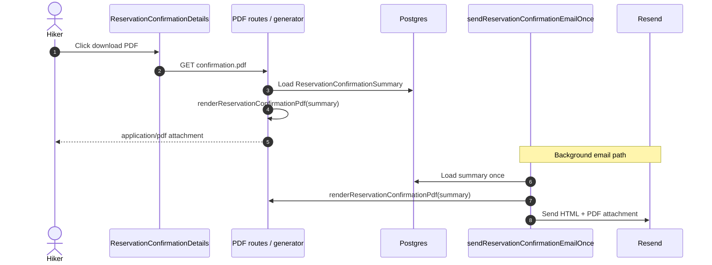

# Reservation Confirmed Flow Phase 3: PDF Confirmation & Invoice

## Overview

Add on-demand PDF generation for reservation confirmations. The PDF combines the shared reservation summary, a detailed invoice for the Napmmit reservation fee, and legally required terms and conditions. The same PDF is attached to the Phase 1 confirmation email and downloadable from reservation confirmation surfaces in Phase 2.

Reference: `docs/reservation-confirmed-flow-plan.md`.

Depends on:

- `context/features/reservation-confirmed-phase-1-email-spec.md`
- `context/features/reservation-confirmed-phase-2-confirmation-page-spec.md`

## Goal

After a paid reservation exists, hikers should receive a single PDF document that:

- confirms reservation details (dates, beds, status, cottage and guest contact),
- includes a detailed invoice for the Napmmit reservation fee paid via Stripe,
- includes applicable terms and conditions in legally correct Slovak wording,
- is attached to the confirmation email when email delivery succeeds,
- is downloadable on demand from confirmation UI via a button click.

The PDF must use the same `ReservationConfirmationSummary` data as the confirmation page and email.

## Scope

- Add `@react-pdf/renderer` and a shared PDF document component.
- Add a shared server-side PDF generator used by routes and email sending.
- Add on-demand PDF download routes with appropriate access control.
- Attach the generated PDF to the confirmation email sent by `sendReservationConfirmationEmailOnce()`.
- Add PDF download buttons to `ReservationConfirmationDetails` for both variants:
  - `post_payment` on `/reservation/return`
  - `dashboard` on `/dashboard/reservations/[id]`
- Extend `sendMail()` / Resend integration to support file attachments.
- Add Slovak translations for PDF-related UI copy.
- Add focused unit tests for PDF filename helpers, invoice line construction, and legal copy assembly.

## Out Of Scope

- Storing generated PDFs in object storage (Vercel Blob) or issuing immutable archived documents.
- Owner-facing PDF exports or owner reservation detail downloads.
- Full VAT accounting integration, eKasa, or automated tax reporting beyond the invoice fields defined in this spec.
- Replacing or rewriting the public `/terms-of-use` web page; PDF uses a curated legal appendix derived from existing published terms plus reservation-specific clauses.
- Generating PDFs from the Stripe webhook directly.
- Sending PDFs for phone-only anonymous reservations that have no email recipient (page download still works via access token).

## Legal & Product Notes

This spec defines the **technical document structure**. Before production launch, have the final Slovak invoice wording and terms appendix reviewed by a qualified legal/tax advisor.

Important business context from current Napmmit terms:

- Napmmit is **not** the accommodation provider or contract party for the stay.
- The **€1 reservation fee** is the Napmmit service charge paid through Stripe and is the primary invoiced item.
- The **accommodation total** is informational in the PDF so the hiker and cottage owner share the same stay summary; payment for the stay itself happens directly with the cottage unless product policy changes later.

Minimum supplier block on the invoice (from published terms):

- Supplier: Filip Tomeš / Napmmit
- IČO: 17658969
- Contact: info@napmmit.com
- Web: www.napmmit.com

If VAT status requires it, add DIČ / IČ DPH fields in the legal constants module during implementation review.

## User Flow

### Email Attachment Flow

1. Hiker completes Stripe payment and the webhook creates a paid `pending` reservation.
2. `/reservation/return` schedules `sendReservationConfirmationEmailOnce()` via `after()`.
3. Email coordinator loads `ReservationConfirmationSummary`.
4. Server generates PDF buffer from the summary.
5. Resend sends the confirmation email with the PDF attached.
6. Email body may keep a download link as fallback, but the attachment is the primary PDF delivery channel.

### On-Demand Download From Post-Payment Page

1. Hiker lands on `/reservation/return` confirmation page.
2. Hiker clicks **Stiahnuť potvrdenie (PDF)**.
3. Browser requests the PDF route using the reservation access token.
4. Server regenerates the PDF on demand and returns `application/pdf`.

### On-Demand Download From Dashboard Detail

1. Logged-in hiker opens `/dashboard/reservations/[id]`.
2. Hiker clicks **Stiahnuť potvrdenie (PDF)**.
3. Browser requests the authenticated dashboard PDF route for that reservation ID.
4. Server verifies ownership, loads summary, generates PDF, and returns the file.



## Functional Requirements

### Shared PDF Generator

Create `src/lib/pdf/render-reservation-confirmation-pdf.ts`.

Export:

```ts
export function getReservationConfirmationPdfFilename(
  summary: ReservationConfirmationSummary,
): string;

export async function renderReservationConfirmationPdf(
  summary: ReservationConfirmationSummary,
): Promise<Buffer>;
```

Requirements:

- Input is always `ReservationConfirmationSummary`; do not rebuild pricing or guest contact separately.
- Generation is **on demand** every time (route click or email send).
- Output filename pattern: `napmmit-rezervacia-{reservationId}.pdf`
- Use UTF-8 capable fonts for Slovak diacritics in `@react-pdf/renderer`.

### PDF Document Component

Create `src/lib/pdf/reservation-confirmation-document.tsx`.

The document must contain these sections in order:

#### 1. Header

- Napmmit branding/title
- Document title: `Potvrdenie rezervácie a doklad k rezervačnému poplatku`
- Reservation number: `summary.id`
- Issue date: generation timestamp in `Europe/Bratislava`
- Reservation status label (including pending owner confirmation when applicable)
- Payment status label

#### 2. Reservation Details

Mirror Phase 2 confirmation page content:

- stay dates and nights
- beds reserved
- cottage name and address
- cottage contact details
- guest name, email, phone

#### 3. Detailed Invoice

Create a dedicated invoice subsection with tabular line items.

Required invoice metadata:

| Field | Source / rule |
| --- | --- |
| Document type | `Daňový doklad / Potvrdenie o prijatej platbe` (final label subject to legal review) |
| Document number | `NR-{summary.id}` or `NR-{summary.id}-{YYYYMMDD}` |
| Supplier | legal constants module |
| Customer | guest name/email from summary |
| Payment method | `Online platba (Stripe)` |
| Payment date | reservation `paidAt` when available; fallback to generation date |
| Currency | EUR |

Required line items:

| Line | Amount basis | Notes |
| --- | --- | --- |
| Rezervačný poplatok Napmmit | `summary.reservationFeeCents / 100` | **Invoiced / paid through Napmmit** |
| Ubytovanie – informatívny prehľad | `summary.accommodationTotal` | **Informational only**; payable directly to cottage unless product policy changes |

Required totals block:

- reservation fee paid
- accommodation informational subtotal
- note clarifying which amount was collected by Napmmit via Stripe

If Stripe payment identifiers are available on the loaded summary/query layer, include:

- `stripePaymentIntentId` when present

If not yet on `ReservationConfirmationSummary`, extend the summary query in this phase only when needed for the PDF invoice block.

#### 4. Terms And Conditions Appendix

Create `src/lib/pdf/reservation-confirmation-legal-copy.ts` with structured Slovak legal text used by the PDF renderer.

The appendix must include, at minimum:

- reference to Napmmit as platform operator, not accommodation provider
- reservation lifecycle: paid pending reservation awaits cottage owner confirmation
- cancellation/refund rule: hiker cancellation allowed up to 48 hours before stay start; reservation fee refund amount €0.50 where applicable
- limitation of liability consistent with published `/terms-of-use`
- governing law: Slovak Republic
- link/reference to full terms: `https://www.napmmit.com/terms-of-use`
- privacy reference: `https://www.napmmit.com/privacy-policy`

Implementation rule:

- Do not scrape the React legal page at runtime.
- Maintain PDF legal copy in a dedicated module so wording can be reviewed independently from the website page component.
- Keep the website `/terms-of-use` page as the canonical public document; PDF appendix is a reservation-context excerpt plus reservation-specific clauses.

Recommended structure:

```ts
export type ReservationConfirmationLegalCopy = {
  title: string;
  sections: Array<{ heading: string; paragraphs: string[] }>;
};
```

### Public PDF Route (Access Token)

Create `src/app/reservation/[accessToken]/confirmation.pdf/route.ts`.

Behavior:

- Load summary via `getReservationConfirmationSummaryByAccessToken(accessToken)`.
- Return `404` when not found.
- Generate PDF with `renderReservationConfirmationPdf()`.
- Respond with:
  - `Content-Type: application/pdf`
  - `Content-Disposition: attachment; filename="..."`

Security:

- Use `accessToken` only; never expose sequential reservation IDs on a public route.
- Treat access token as an unlisted secret link.

### Authenticated Dashboard PDF Route

Create `src/app/dashboard/reservations/[id]/confirmation.pdf/route.ts`.

Behavior:

- Require authenticated hiker via `validateRequest()`.
- Parse reservation ID from params; invalid IDs return `404`.
- Load summary via `getReservationConfirmationSummaryById(id, user.id)`.
- Return `404` when not found or not owned by the current user.
- Generate and return the same PDF bytes/filename as the public route.

Why both routes exist:

- post-payment page and email fallback links can safely use the token route for anonymous hikers
- dashboard detail uses an authenticated route so logged-in hikers do not depend on copying token URLs

### Confirmation UI Download Buttons

Modify `src/components/reservation/reservation-confirmation-details.tsx`.

Add a PDF download button to both variants when a download target exists.

Rules:

| Variant | Download target |
| --- | --- |
| `post_payment` | `/reservation/${summary.accessToken}/confirmation.pdf` when `accessToken` exists |
| `dashboard` | `/dashboard/reservations/${summary.id}/confirmation.pdf` |

UI requirements:

- Use existing button styling (`Button asChild` + `Link` or anchor download).
- Slovak label: `Stiahnuť potvrdenie (PDF)`
- Hide the button when no safe download target exists (`accessToken` missing on post-payment page).

Do not use `window.open` client generation; always hit server routes so email and UI share one renderer.

### Confirmation Email Attachment

Modify `src/lib/reservation/confirmation.ts`.

When sending the confirmation email:

1. Generate PDF buffer from the loaded summary.
2. Pass attachment to mail sender.
3. Keep idempotent send-once behavior unchanged.

Attachment requirements:

- filename from `getReservationConfirmationPdfFilename(summary)`
- content type `application/pdf`
- attach on successful recipient resolution only

Modify `src/server/db/sendMail.ts` to accept optional attachments compatible with Resend, for example:

```ts
type EmailAttachment = {
  filename: string;
  content: Buffer;
  contentType: string;
};

export type MessageInfo = {
  to: string;
  subject: string;
  body: string;
  attachments?: EmailAttachment[];
};
```

Resend expects base64 attachment content; convert in the mail layer, not in business logic.

Email template changes:

- Keep HTML body summary content from Phase 1.
- PDF button/link in email becomes secondary fallback text such as “PDF je priložený v prílohe emailu.”
- Optional: retain link to `/reservation/${accessToken}/confirmation.pdf` for clients that strip attachments.

Phone-only anonymous reservations:

- Email may still be skipped when no recipient exists.
- PDF remains available through the post-payment page token route.

### Translations

Modify `messages/sk.json`.

Add or extend namespaces:

- `ReservationConfirmationPage.PdfDownload`
- `ReservationConfirmationPage.PdfAttachedNote` (optional helper copy)
- `EmailTemplates.ReservationCreated.PdfAttachedMessage`

Add PDF-specific document strings in a dedicated module under `src/lib/pdf/` rather than overloading UI translation files for long legal paragraphs.

## Suggested Files

- `src/lib/pdf/render-reservation-confirmation-pdf.ts`
- `src/lib/pdf/reservation-confirmation-document.tsx`
- `src/lib/pdf/reservation-confirmation-legal-copy.ts`
- `src/lib/pdf/reservation-confirmation-invoice.ts`
- `src/lib/pdf/legal-constants.ts`
- `src/app/reservation/[accessToken]/confirmation.pdf/route.ts`
- `src/app/dashboard/reservations/[id]/confirmation.pdf/route.ts`
- `src/lib/reservation/confirmation.ts`
- `src/server/db/sendMail.ts`
- `src/components/reservation/reservation-confirmation-details.tsx`
- `src/lib/reservation/summary-queries.ts` (only if payment identifiers must be added to summary)
- `messages/sk.json`
- Unit test files colocated with tested modules

## Unit Test Requirements

Minimum coverage:

- PDF filename helper
- invoice line item construction from summary (reservation fee vs informational accommodation)
- legal copy module returns required sections/headings
- public PDF route returns `404` for unknown token (handler-level test or extracted auth/summary guard)
- dashboard PDF route returns `404` for unauthorized reservation ID (same approach)
- email send path passes one PDF attachment when summary is valid

Optional snapshot-style tests:

- render document component to buffer in one smoke test if stable in CI

## Manual Test Checklist

Using Stripe CLI:

```bash
stripe listen --forward-to localhost:3000/api/webhooks/stripe
```

Check:

- confirmation email arrives with one PDF attachment
- attached PDF opens and shows reservation details, invoice block, and terms appendix
- Slovak diacritics render correctly in the PDF
- post-payment confirmation page download button returns the same document content
- dashboard reservation detail download button returns the same document for the owning hiker
- anonymous hiker can download via access-token URL
- logged-in hiker cannot download another user's dashboard PDF route
- unknown access token returns `404`
- duplicate email scheduling still sends only one email with one attachment
- phone-only anonymous reservation skips email but still allows page PDF download
- PDF reflects updated reservation status after owner confirmation/cancellation when regenerated on demand

### Regression Checks

- Phase 1 email idempotency still works
- Phase 2 confirmation pages still render
- confirmation email HTML body still renders when attachment generation succeeds
- if PDF generation fails during email send, failure is logged and email failure handling remains predictable (see implementation note below)
- `bun lint-format` and `bun build` pass

## Acceptance Criteria

- A shared PDF renderer produces reservation confirmation documents from `ReservationConfirmationSummary`.
- PDF includes reservation details, detailed invoice for the Napmmit reservation fee, and a terms appendix with legally reviewed Slovak copy maintained in code.
- Confirmation email includes the PDF as an attachment when sending to an email recipient.
- Post-payment and dashboard confirmation pages expose a working on-demand PDF download button.
- Public token route and authenticated dashboard route enforce the access rules above.
- Slovak UI strings for download actions are present.
- Focused unit tests pass locally.
- `bun lint-format` passes.
- `bun build` passes.

## Implementation Notes

- Prefer `@react-pdf/renderer` with server-side `renderToBuffer()`.
- Keep one document component; do not fork separate “email PDF” and “download PDF” layouts.
- Regenerate on demand so status changes (pending → confirmed/cancelled) appear on subsequent downloads.
- Consider extracting invoice math/formatting into `reservation-confirmation-invoice.ts` for testability.
- If Resend attachment size limits become an issue, log attachment byte size during development.
- Recommended failure policy for email send:
  - if PDF rendering fails, treat the send as failed using existing `confirmationEmailFailedAt` handling rather than sending a confirmation email without the required attachment
- Update Stripe Dashboard webhook path documentation if still referencing the old `/api/stripe/webhook` location.
- After implementation, remove or downgrade the email-only PDF link CTA if it duplicates the attachment-first UX.

## Follow-Up Phases (Not Part Of Phase 3)

- Persist immutable PDF snapshots to object storage for audit/legal retention
- Owner status-change emails with PDF or receipt variants
- Durable background email queue and retry for hikers who never return to the return page
- eKasa / full VAT invoice automation if business registration requires it
