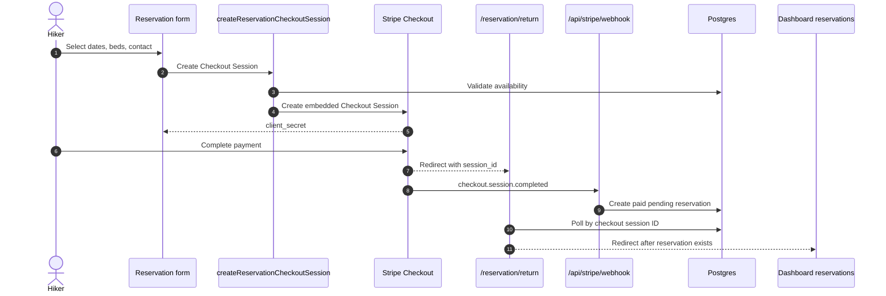
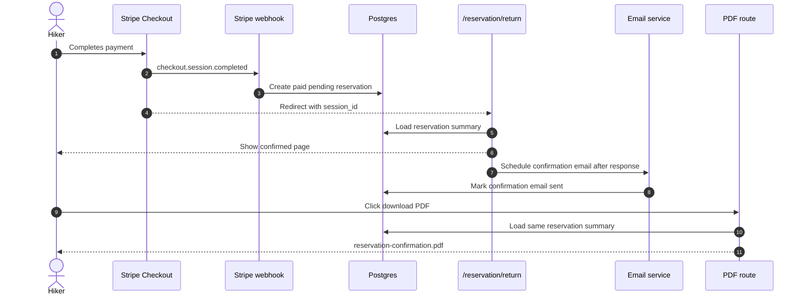
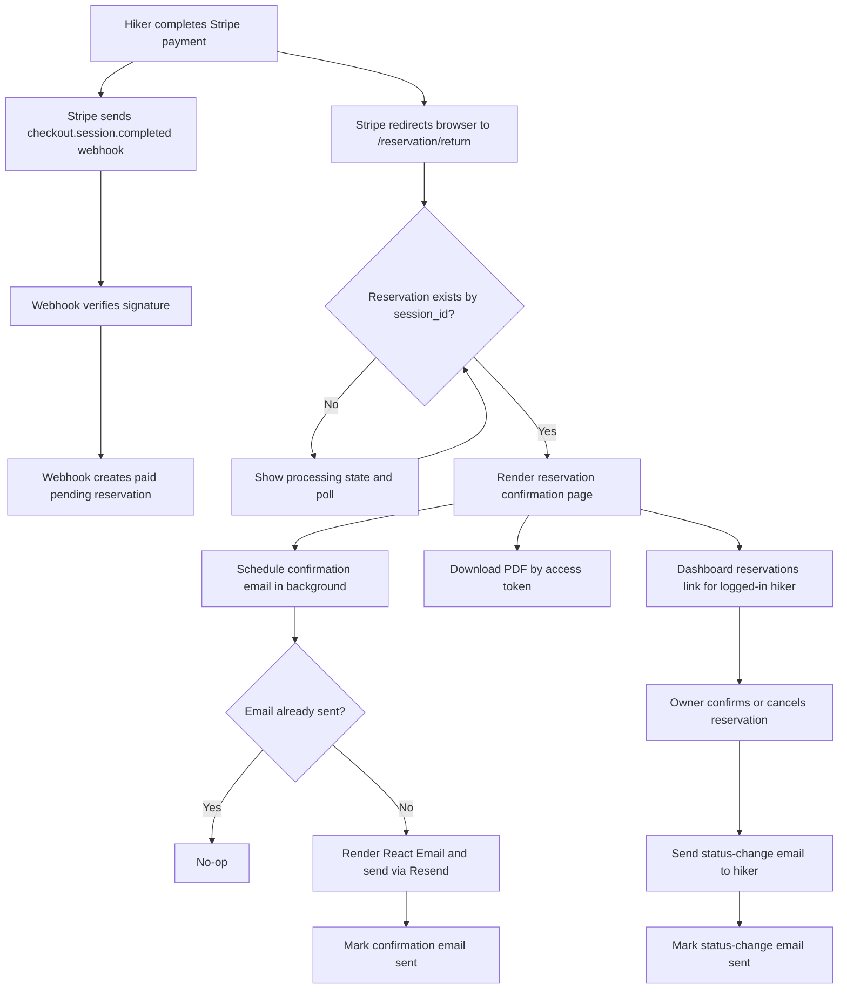

# Reservation Confirmed Flow Plan

## Goal

After Stripe confirms payment for a reservation, Napmmit should show a reservation confirmed page and send a reservation confirmation email in the background. The page, email, and downloadable PDF should present the same reservation summary:

- reservation dates
- reservation status
- number of beds reserved
- price and full price calculation
- cottage contact information
- hiker contact information
- link to the logged-in user's reservation dashboard
- PDF download with the same information

The current payment architecture already follows the correct source-of-truth rule: Stripe's signed webhook creates the paid reservation. The new confirmed flow should build on that and replace the current dashboard redirect with a dedicated confirmation experience.

## Current State Analysis

### Existing Payment And Reservation Flow

The current flow is:

1. `src/components/cottageDetail/reservation-section.tsx` validates the selected dates, guests, and anonymous contact details in the browser.
2. It calls `createReservationCheckoutSession()` from `src/app/actions/stripe.ts`.
3. `createReservationCheckoutSession()` validates reservation input server-side, checks availability, and creates an embedded Stripe Checkout Session.
4. Stripe returns to `/reservation/return?session_id={CHECKOUT_SESSION_ID}`.
5. Stripe also sends `checkout.session.completed` to `src/app/api/stripe/webhook/route.ts`.
6. The webhook verifies `STRIPE_WEBHOOK_SECRET`, parses reservation metadata, checks idempotency by `stripeCheckoutSessionId`, and calls `createPaidReservation()`.
7. `createPaidReservation()` inserts a `pending` reservation with `paymentStatus: 'paid'`, Stripe IDs, `paidAt`, `reservation_days`, and an `accessToken`.
8. `src/app/reservation/return/page.tsx` calls `getReservationPaymentStatus()`.
9. If the reservation exists, the return page currently redirects to `ROUTES.DASHBOARD.RESERVATIONS`.
10. If the reservation does not exist yet, `ReservationReturnStatus` polls until the webhook-created reservation appears, then redirects to the dashboard.




### Existing Reservation Data

`src/server/db/schema.ts` already has most fields needed for the confirmation view:

- `reservations.from`
- `reservations.to`
- `reservations.status`
- `reservations.bedsReserved`
- `reservations.pricePerNight`
- `reservations.totalPrice`
- `reservations.reservationFeeCents`
- `reservations.paymentStatus`
- `reservations.stripeCheckoutSessionId`
- `reservations.stripePaymentIntentId`
- `reservations.paidAt`
- `reservations.guestEmail`
- `reservations.guestPhone`
- `reservations.userId`
- `reservations.cottageId`
- `reservations.accessToken`

`cottages` already has the cottage contact data:

- `cottages.name`
- `cottages.address`
- `cottages.phoneNumber`
- `cottages.email`
- `cottages.website`

`users` already has logged-in hiker contact data:

- `users.email`
- `users.phoneNumber`
- `users.username`

### Existing Return Page

`src/app/reservation/return/page.tsx` currently treats a created reservation as a terminal state and immediately redirects:

```tsx
if (paymentStatus.status === 'reservation_created') {
  redirect(ROUTES.DASHBOARD.RESERVATIONS);
}
```

`src/app/reservation/return/reservation-return-status.tsx` does the same client-side after polling:

```tsx
if (status.status === 'reservation_created') {
  router.replace(ROUTES.DASHBOARD.RESERVATIONS);
  return;
}
```

This is the main behavior to change. The page should render a confirmation summary once the paid reservation exists.

### Existing Email Infrastructure

The project already has:

- `resend` dependency
- `@react-email/components`
- `@react-email/render`
- `src/server/db/sendMail.ts`
- `src/lib/emailTemplates/reservation-created.tsx`
- `src/lib/emailTemplates/reservation-cancelled.tsx`
- email constants in `src/lib/constants.ts`

The existing `ReservationCreatedEmail` renders a pending-reservation message, dates, beds, and total price. It does not yet include:

- cottage contact information
- hiker contact information
- full price calculation
- reservation fee/payment state
- dashboard link
- PDF download link

The template exists, but no reservation flow currently calls `renderReservationCreatedEmail()` or `sendMail()` after the webhook creates a reservation.

### Existing Dashboard Display

`src/app/dashboard/reservations/page.tsx` renders:

- `HikerReservationCard`
- `OwnerReservationCard`

The cards already display dates, beds, total price, and status. Hiker cards also display anonymous guest email/phone when present. Current reservation query types only include cottage `id`, `name`, and `images`, so confirmation page/email/PDF queries need a richer reservation summary shape.

### Existing PDF Support

No PDF route, PDF component, or PDF dependency was found. The plan should add one.

Recommended dependency: `@react-pdf/renderer`, because it lets the app create a server-rendered PDF from a React component and keep the PDF layout close to the email/page summary model.

## Recommended Target Flow

The webhook remains the source of truth for payment confirmation and reservation creation. The return page becomes the confirmation page.




Important wording: the created reservation status is still `pending`, because owner approval is a separate lifecycle step. The page title can say "Rezervácia bola prijatá" or "Rezervácia bola vytvorená", while the status row should clearly show `Čaká na potvrdenie chatou`.

## Data Model Changes

Add notification tracking to make background email idempotent:

### Modify `src/server/db/schema.ts`

Add fields to `reservations`:

```ts
confirmationEmailSentAt: timestamp('confirmation_email_sent_at'),
confirmationEmailMessageId: varchar('confirmation_email_message_id', {
  length: 255,
}),
confirmationEmailFailedAt: timestamp('confirmation_email_failed_at'),
```

Why:

- The return page may be refreshed.
- The status polling client may call the same action multiple times.
- Stripe webhooks can be retried.
- Email sending should happen once per reservation unless manually retried.

Create a Drizzle migration with:

```bash
bun drizzle-kit generate
```

## Shared Reservation Summary

Create one shared data shape for page, email, and PDF so the same information is not reconstructed three different ways.

### Create `src/lib/reservation/summary.ts`

This module should fetch and format the confirmation data.

Example shape:

```ts
export type ReservationConfirmationSummary = {
  id: number;
  accessToken: string | null;
  status: 'pending' | 'confirmed' | 'cancelled' | 'completed';
  paymentStatus: 'unpaid' | 'paid' | 'refunded' | 'refund_failed';
  from: string;
  to: string;
  nights: number;
  bedsReserved: number;
  pricePerNight: number;
  accommodationTotal: number;
  reservationFeeCents: number;
  grandTotal: number;
  cottage: {
    id: number;
    name: string;
    address: string;
    email: string | null;
    phoneNumber: string | null;
    website: string | null;
  };
  guest: {
    name: string | null;
    email: string | null;
    phoneNumber: string | null;
    isLoggedIn: boolean;
  };
};
```

Recommended functions:

```ts
export async function getReservationConfirmationSummaryByCheckoutSession(
  checkoutSessionId: string,
): Promise<ReservationConfirmationSummary | null> {
  // Query reservations by stripeCheckoutSessionId with cottage and user.
}

export async function getReservationConfirmationSummaryByAccessToken(
  accessToken: string,
): Promise<ReservationConfirmationSummary | null> {
  // Used by anonymous-safe PDF downloads.
}

export function getReservationPriceBreakdown(summary: ReservationConfirmationSummary) {
  return {
    accommodation: summary.nights * summary.pricePerNight * summary.bedsReserved,
    reservationFee: summary.reservationFeeCents / 100,
    grandTotal: summary.grandTotal,
  };
}
```

Implementation notes:

- Keep date parsing consistent with `src/lib/reservation-date-range.ts`.
- Use `differenceInDays()` for nights, as `reservation-section.tsx` already does.
- Treat `totalPrice` as the accommodation total currently shown to users.
- Show `reservationFeeCents / 100` separately as the paid Napmmit reservation fee.
- Use logged-in `users.email` and `users.phoneNumber` when `reservation.userId` exists.
- Use `guestEmail` and `guestPhone` for anonymous reservations.

## Confirmation Page

### Modify `src/lib/reservation/payment-status.ts`

Extend `ReservationPaymentStatus` to return enough information to render or link to the reservation confirmation:

```ts
export type ReservationPaymentStatus =
  | { status: 'missing_session' }
  | { status: 'not_found' }
  | {
      status: 'reservation_created';
      reservationId: number;
      reservationStatus: ReservationStatusType;
      paymentStatus: PaymentStatusType;
      accessToken: string | null;
    };
```

### Modify `src/app/reservation/return/page.tsx`

Replace dashboard redirect with server-rendered confirmation content.

Recommended behavior:

- Missing `session_id`: show the existing missing payment state.
- `not_found`: render `ReservationReturnStatus` polling component.
- `reservation_created`: load `ReservationConfirmationSummary` and render the confirmed page.
- Schedule email sending after the response using `after()` from `next/server`, or call an idempotent server function that can safely no-op if already sent.

Example:

```tsx
import { after } from 'next/server';
import { ReservationConfirmationDetails } from '@/components/reservation/reservation-confirmation-details';
import {
  getReservationConfirmationSummaryByCheckoutSession,
  sendReservationConfirmationEmailOnce,
} from '@/lib/reservation/confirmation';

if (paymentStatus.status === 'reservation_created') {
  const summary = await getReservationConfirmationSummaryByCheckoutSession(
    checkoutSessionId,
  );

  if (!summary) {
    notFound();
  }

  after(() => sendReservationConfirmationEmailOnce(summary.id));

  return <ReservationConfirmationDetails summary={summary} />;
}
```

### Modify `src/app/reservation/return/reservation-return-status.tsx`

Change polling success behavior from dashboard redirect to refreshing the return page:

```tsx
if (status.status === 'reservation_created') {
  router.refresh();
  return;
}
```

This lets the server component render the confirmation page using the same `session_id`.

### Create `src/components/reservation/reservation-confirmation-details.tsx`

Render the summary used by the page.

Include:

- success heading
- reservation status badge
- date range
- nights count
- beds reserved
- accommodation price calculation
- reservation fee
- total/paid summary
- cottage contact card
- hiker contact card
- dashboard button for logged-in users
- PDF download button for all users with an access token

Example UI structure:

```tsx
export function ReservationConfirmationDetails({
  summary,
}: ReservationConfirmationDetailsProps) {
  return (
    <main className="mx-auto max-w-3xl px-6 py-12">
      <section className="rounded-lg border bg-white p-6 shadow-xs">
        <p className="text-sm font-medium text-green-700">
          Platba bola potvrdená
        </p>
        <h1 className="mt-2 text-2xl font-semibold">
          Rezervácia bola prijatá
        </h1>
        {/* Summary rows, contact blocks, actions */}
      </section>
    </main>
  );
}
```

Dashboard link behavior:

- If `summary.guest.isLoggedIn` is true, show a primary button to `ROUTES.DASHBOARD.RESERVATIONS`.
- If anonymous, do not show the dashboard button. Show copy that the confirmation was sent to the provided email/phone.

PDF link:

```tsx
{summary.accessToken && (
  <Button variant="outline" asChild>
    <Link href={`/reservation/${summary.accessToken}/confirmation.pdf`}>
      Stiahnuť PDF
    </Link>
  </Button>
)}
```

## Confirmation Email

### Create `src/lib/reservation/confirmation.ts`

This module should coordinate email sending and idempotency.

Recommended exports:

```ts
export async function sendReservationConfirmationEmailOnce(
  reservationId: number,
): Promise<{ success: true } | { error: string }> {
  // 1. Load reservation with user and cottage.
  // 2. If confirmationEmailSentAt exists, return success.
  // 3. Resolve recipient:
  //    - reservation.user.email for logged-in hiker
  //    - reservation.guestEmail for anonymous hiker
  // 4. If no email recipient exists, no-op or mark failed with a clear reason.
  // 5. Render email.
  // 6. Send via sendMail().
  // 7. Store confirmationEmailSentAt and provider message ID.
}
```

Concurrency note:

- Ideally wrap the "already sent?" check and a sending state in a transaction.
- Because sending email inside a DB transaction can hold locks during network I/O, the safer simple implementation is:
  - add `confirmationEmailSendingAt` too, or
  - update a "claim" field first, then send, then mark sent.
- If keeping the schema minimal, make the function idempotent enough for expected page refreshes and log duplicate-send risk as acceptable for MVP.

### Owner Status Change Emails

When a cottage owner changes a reservation status, Napmmit should also notify the hiker by email. This applies to the existing owner actions in `src/app/dashboard/reservations/owner-reservation-card.tsx`:

- confirming a reservation through `confirmReservation()`
- cancelling a reservation through `deleteReservation()`

Recommended behavior:

- After `confirmReservation()` changes `status` to `confirmed`, send a "reservation confirmed by cottage" email to the hiker.
- After an owner cancels a reservation, send a "reservation cancelled by cottage" email to the hiker.
- Keep hiker-initiated cancellation emails separate from owner-initiated cancellation emails if the copy differs.
- Use the same recipient resolution as the payment confirmation email:
  - logged-in hiker: `reservation.user.email`
  - anonymous hiker: `reservation.guestEmail`
  - phone-only anonymous hiker: no email, but log a clear no-recipient event
- Make each status-change email idempotent so repeated clicks, retries, or refreshes do not send duplicates.

Suggested exports:

```ts
export async function sendReservationStatusChangedEmailOnce(
  reservationId: number,
  status: 'confirmed' | 'cancelled',
  actor: 'owner' | 'hiker',
): Promise<{ success: true } | { error: string }> {
  // Load summary, resolve recipient, choose template, send once, store delivery metadata.
}
```

For the first implementation, send these emails from the server actions after the database update succeeds. If email sending fails, the status change should remain committed and the failure should be recorded for manual follow-up or retry.

### Modify `src/lib/emailTemplates/reservation-created.tsx`

Rename only if desired. The existing name can stay, but the content should become a full confirmation summary.

Add:

- status
- dates
- beds
- nights
- price calculation
- cottage contact details
- hiker contact details
- dashboard link when available
- PDF link when available

Recommended props:

```ts
type Props = {
  summary: ReservationConfirmationSummary;
  dashboardUrl?: string;
  pdfUrl?: string;
  locale?: string;
};
```

Example email content:

```tsx
<Text style={text}>
  Termín: {formatDate(summary.from)} - {formatDate(summary.to)}
</Text>
<Text style={text}>
  Cena ubytovania: {summary.nights} nocí x {summary.bedsReserved} lôžok x{' '}
  {summary.pricePerNight} € = {summary.accommodationTotal} €
</Text>
<Text style={text}>
  Rezervačný poplatok Napmmit: {summary.reservationFeeCents / 100} €
</Text>
```

### Modify `messages/sk.json`

Add a namespace for the confirmation page and expand `EmailTemplates.ReservationCreated`.

Suggested namespaces:

- `ReservationConfirmationPage`
- `EmailTemplates.ReservationCreated`
- `EmailTemplates.ReservationStatusChanged`

Keep copy explicit that the reservation is paid and created, but still awaiting cottage owner confirmation when `status === 'pending'`.

## PDF Download

### Add Dependency

```bash
bun add @react-pdf/renderer
```

### Create `src/lib/pdf/reservation-confirmation-document.tsx`

Create a React PDF document that accepts the same `ReservationConfirmationSummary`.

Example:

```tsx
import { Document, Page, Text, View } from '@react-pdf/renderer';

export function ReservationConfirmationDocument({
  summary,
}: ReservationConfirmationDocumentProps) {
  return (
    <Document>
      <Page size="A4">
        <View>
          <Text>Napmmit - potvrdenie rezervácie</Text>
          <Text>Rezervácia #{summary.id}</Text>
          <Text>Status: {summary.status}</Text>
        </View>
      </Page>
    </Document>
  );
}
```

### Create `src/app/reservation/[accessToken]/confirmation.pdf/route.ts`

Use the reservation `accessToken` so anonymous users can download the PDF without a dashboard account.

Recommended behavior:

- Fetch summary by access token.
- Return `404` if not found.
- Render PDF.
- Return `application/pdf` with `Content-Disposition: attachment`.

Example:

```ts
import { renderToBuffer } from '@react-pdf/renderer';
import { NextResponse } from 'next/server';
import { ReservationConfirmationDocument } from '@/lib/pdf/reservation-confirmation-document';
import { getReservationConfirmationSummaryByAccessToken } from '@/lib/reservation/summary';

export async function GET(
  _request: Request,
  { params }: { params: Promise<{ accessToken: string }> },
) {
  const { accessToken } = await params;
  const summary = await getReservationConfirmationSummaryByAccessToken(accessToken);

  if (!summary) {
    return NextResponse.json({ error: 'reservation_not_found' }, { status: 404 });
  }

  const pdf = await renderToBuffer(
    <ReservationConfirmationDocument summary={summary} />,
  );

  return new NextResponse(pdf, {
    headers: {
      'Content-Type': 'application/pdf',
      'Content-Disposition': `attachment; filename="napmmit-reservation-${summary.id}.pdf"`,
    },
  });
}
```

Security note:

- `accessToken` is already a UUID-like random token. It is suitable for anonymous reservation links if treated as a secret.
- Do not expose sequential reservation IDs as public PDF identifiers.
- Consider rotating or expiring access tokens later if needed.

## Files To Create

### `src/lib/reservation/summary.ts`

Purpose:

- shared reservation confirmation summary query
- price breakdown helper
- date formatting helpers if needed

Key implementation details:

- query by `stripeCheckoutSessionId` for the return page
- query by `accessToken` for PDF
- include `reservation.user` and `reservation.cottage`
- include cottage contact fields, not just `id` and `name`

### `src/lib/reservation/confirmation.ts`

Purpose:

- `sendReservationConfirmationEmailOnce(reservationId)`
- recipient resolution
- email idempotency
- email delivery persistence

### `src/components/reservation/reservation-confirmation-details.tsx`

Purpose:

- confirmed page UI
- reuse summary shape
- dashboard/PDF actions

### `src/lib/pdf/reservation-confirmation-document.tsx`

Purpose:

- PDF layout with the same summary fields

### `src/app/reservation/[accessToken]/confirmation.pdf/route.ts`

Purpose:

- public-by-token PDF download route

### Optional: `src/components/reservation/reservation-price-breakdown.tsx`

Purpose:

- share page price breakdown UI
- useful if the same breakdown appears later in dashboards

## Files To Modify

### `src/server/db/schema.ts`

Add email tracking columns:

- `confirmationEmailSentAt`
- `confirmationEmailMessageId`
- `confirmationEmailFailedAt`
- `statusConfirmedEmailSentAt`
- `statusConfirmedEmailMessageId`
- `statusCancelledEmailSentAt`
- `statusCancelledEmailMessageId`

Optional stronger idempotency:

- `confirmationEmailSendingAt`
- `statusEmailSendingAt`

### Drizzle Migration

Generate a migration for the new columns.

### `src/app/reservation/return/page.tsx`

Change from redirecting to dashboard to rendering the confirmation page.

Also schedule email sending:

```tsx
after(() => sendReservationConfirmationEmailOnce(summary.id));
```

### `src/app/reservation/return/reservation-return-status.tsx`

Change success handling:

```tsx
router.refresh();
```

instead of:

```tsx
router.replace(ROUTES.DASHBOARD.RESERVATIONS);
```

### `src/lib/reservation/payment-status.ts`

Return typed reservation status, payment status, and access token.

### `src/lib/emailTemplates/reservation-created.tsx`

Expand from a minimal pending-reservation email into the full confirmation summary email.

### `src/lib/emailTemplates/reservation-status-changed.tsx`

Create a status-change email template for owner-driven reservation updates.

It should cover:

- owner confirmed the reservation
- owner cancelled the reservation
- reservation dates, beds, price, cottage contact, hiker contact, dashboard link, and PDF link

### `src/lib/reservation/actions.ts`

Update owner status actions so email is sent after a successful database update:

- `confirmReservation()` sends a `confirmed` status-change email.
- owner-triggered `deleteReservation()` sends a `cancelled` status-change email.
- hiker-triggered `deleteReservation()` can keep separate cancellation behavior/copy.

### `messages/sk.json`

Add translation strings for:

- confirmation page title
- payment confirmed state
- pending owner confirmation state
- price breakdown labels
- cottage contact labels
- hiker contact labels
- dashboard CTA
- PDF CTA
- email content
- owner-confirmed reservation email content
- owner-cancelled reservation email content

### `package.json` and `bun.lock`

Add `@react-pdf/renderer`.

## Implementation Order

1. Add the DB columns for confirmation email tracking and generate the Drizzle migration.
2. Create `ReservationConfirmationSummary` and shared summary query helpers.
3. Create the confirmation page component and price breakdown UI.
4. Modify `/reservation/return` to render the confirmation page instead of redirecting.
5. Modify the polling client to `router.refresh()` when the webhook-created reservation appears.
6. Implement `sendReservationConfirmationEmailOnce()` with recipient resolution and idempotency.
7. Expand `ReservationCreatedEmail` to use the shared summary.
8. Schedule email sending from the confirmation page using `after()`.
9. Implement owner status-change email sending from `confirmReservation()` and owner-triggered cancellation.
10. Add `@react-pdf/renderer`.
11. Create the PDF document component and tokenized PDF route.
12. Add translations.
13. Add focused tests.
14. Run lint/format and payment flow checks.

## Testing Checklist

### Unit Tests

Add or extend tests for:

- summary price breakdown:
  - one-night reservation
  - multi-night reservation
  - multiple beds
  - reservation fee cents conversion
- recipient resolution:
  - logged-in hiker uses `user.email`
  - anonymous hiker uses `guestEmail`
  - phone-only anonymous reservation does not attempt email
- email idempotency:
  - no send when `confirmationEmailSentAt` is already set
  - marks sent after successful Resend response
  - marks failed/logs on send failure
- owner status-change email idempotency:
  - confirming an already confirmed reservation does not resend email
  - cancelling an already cancelled reservation does not resend email
  - owner cancellation and hiker cancellation can use different copy/tracking
- payment status:
  - missing session
  - not found
  - reservation created with access token

### Integration / Manual Tests

Using Stripe CLI:

```bash
stripe listen --forward-to localhost:3000/api/stripe/webhook
```

Check:

- completed payment creates exactly one paid pending reservation
- return page first shows processing if webhook has not finished
- return page refreshes into the confirmation page after reservation creation
- return page does not redirect to dashboard
- confirmation page shows dates, status, beds, price calculation, cottage contact, and hiker contact
- logged-in hiker sees dashboard CTA
- anonymous hiker does not see dashboard CTA
- confirmation email sends once
- refreshing confirmation page does not send duplicate emails
- PDF downloads successfully
- PDF URL works for anonymous reservations using `accessToken`
- duplicate `checkout.session.completed` does not duplicate reservations or emails
- phone-only anonymous reservation still shows confirmation page and PDF, but skips email with a clear log
- owner confirmation sends a status-change email to the hiker
- owner cancellation sends a status-change email to the hiker
- repeated owner confirm/cancel actions do not send duplicate status-change emails

### Regression Tests

Check existing behavior:

- availability still counts `pending` and `confirmed`
- owner dashboard can still confirm/cancel reservations
- hiker dashboard still shows newly created paid pending reservations
- cancellation refund behavior still works
- invalid/missing webhook signatures still return `400`

## Open Decisions

### Email Trigger Location

Recommended MVP: trigger the email from the confirmation page with `after()` and idempotency.

Why:

- It best matches "first show the page and as a background process send the email".
- It keeps the webhook focused on payment confirmation and reservation creation.
- It avoids delaying Stripe webhook acknowledgment on email provider latency.

Tradeoff:

- If a hiker pays but never returns to the site, the confirmation email may not send.

More robust later option:

- Send from a durable background job or queue after webhook reservation creation.
- The queue can still avoid blocking the webhook and can retry failures.

### Reservation Wording

Use precise copy:

- "Payment confirmed" means Stripe payment succeeded.
- "Reservation created" means Napmmit saved the reservation.
- "Pending" means the cottage owner still needs to approve.

Avoid saying "owner-confirmed" until `status === 'confirmed'`.

### PDF Generation Strategy

Recommended MVP: generate PDF on demand from the access token.

Why:

- No storage needed.
- The PDF always reflects the latest reservation status.
- It avoids creating files during webhook or page rendering.

Later option:

- Store generated PDFs in Vercel Blob if immutable confirmation documents become a product/legal requirement.

## Final Target Flow




This plan preserves the existing webhook-first payment integrity while adding the user-facing confirmation page, background email delivery, and PDF download requested by the feature.