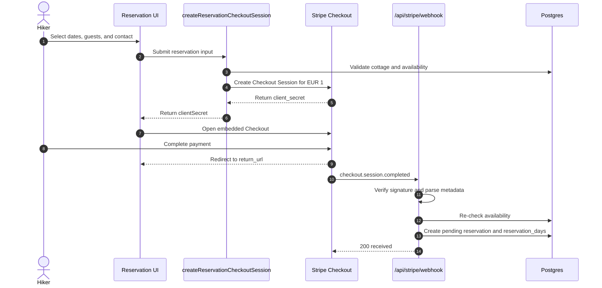
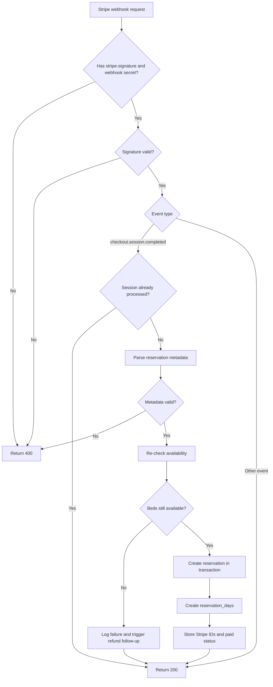
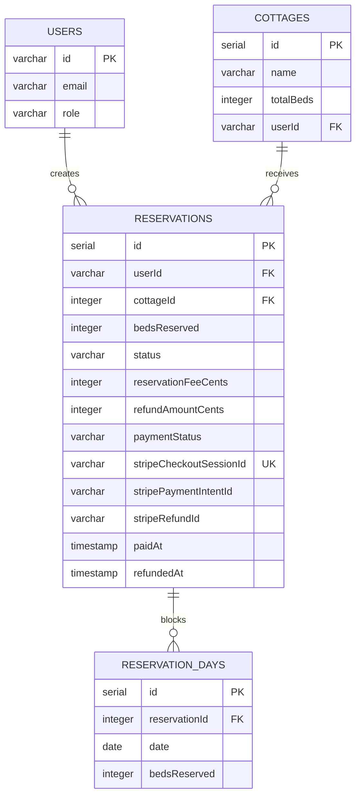
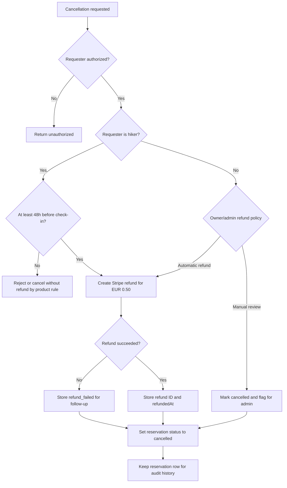
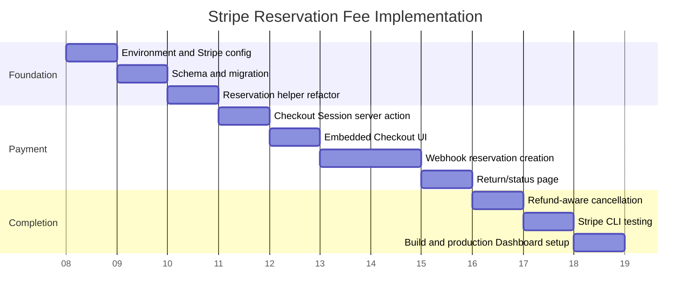

# Stripe Integration Plan

## Goal

Napmmit should charge a fixed EUR 1 reservation fee before creating a reservation. The accommodation payment stays offline between the hiker and cottage owner. Stripe is used for:

- EUR 1 reservation fee collection
- EUR 0.50 cancellation refund
- payment confirmation through signed webhooks

Use Stripe Checkout Sessions for the first implementation. The project already has `stripe`, `@stripe/stripe-js`, and `@stripe/react-stripe-js` installed, so no new payment dependency is required.

## Current State Analysis

### Existing Stripe Code

Stripe is partially wired but not connected to the reservation lifecycle yet.

- `src/lib/stripe.ts` creates a Stripe SDK client from `STRIPE_SECRET_KEY`.
- `src/lib/stripe.ts` hardcodes `STRIPE_RESERVATION_PRICE_ID`.
- `src/app/actions/stripe.ts` creates an embedded Checkout Session from a caller-provided `priceId`.
- `src/app/api/stripe/webhook/route.ts` verifies webhook signatures and listens for `checkout.session.completed`, but it only logs the successful session.
- `.env.example` includes `NEXT_PUBLIC_STRIPE_PUBLISHABLE_KEY` and `STRIPE_SECRET_KEY`, but does not include `STRIPE_WEBHOOK_SECRET` or a configurable reservation price ID.

Important gaps:

- Checkout is not launched from the reservation form.
- Successful payment does not create a reservation.
- The webhook does not update database state.
- The hardcoded price ID should move to an environment variable.
- The webhook handler uses `catch (err: any)`, which conflicts with the project's TypeScript standards.
- The current Checkout action accepts a raw `priceId`, which lets callers choose what product to charge for. Reservation checkout should use the server-side reservation fee price only.

### Existing Reservation Flow

`src/components/cottageDetail/reservation-section.tsx` currently calls `createReservation()` directly when the user clicks reserve. On success, it resets the form, invalidates availability queries, and updates URL date params.

`src/lib/reservation/actions.ts` currently:

- validates input
- requires guest email or phone for anonymous users
- checks availability
- creates a `pending` reservation
- creates rows in `reservation_days`

This is close to the desired flow, but it happens before payment. The Stripe implementation should move reservation creation behind the `checkout.session.completed` webhook.

### Reservation Schema

`src/server/db/schema.ts` defines:

- `reservationFee`: integer, not null, default `1`
- `refundAmount`: integer, default `0`
- `status`: varchar, expected values `pending | confirmed | cancelled | completed`
- `reservation_days`: per-day reserved-bed rows

Recommended schema adjustments:

- Treat monetary values as cents, not euros. Store EUR 1 as `100`, EUR 0.50 as `50`.
- Rename or add explicit fields such as `reservationFeeCents` and `refundAmountCents`.
- Add Stripe tracking fields:
  - `stripeCheckoutSessionId`
  - `stripePaymentIntentId`
  - `stripeRefundId`
  - `paymentStatus`
  - `paidAt`
  - `refundedAt`

If keeping the current column names for now, document that `reservationFee` and `refundAmount` are stored in cents to avoid decimal money handling.

### Availability Rules

There is a mismatch to resolve before payment integration:

- `getAvailableBeds()` counts both `pending` and `confirmed` reservations.
- `createReservation()` checks only `confirmed` reservations when inserting a new reservation.

For paid reservations, the webhook should re-check availability using the same rule as the UI. At minimum, it should count `pending` and `confirmed` reservations to avoid overbooking after concurrent payments.

## Recommended Architecture

### Payment Flow

1. Hiker fills out dates, guests, and guest contact details if anonymous.
2. Client calls a server action such as `createReservationCheckoutSession(input)`.
3. The server action validates the reservation input and checks availability, but does not create a reservation yet.
4. The server action creates a Stripe Checkout Session for the fixed EUR 1 reservation fee.
5. Client opens embedded Checkout using the returned `clientSecret`.
6. Stripe sends `checkout.session.completed`.
7. Webhook verifies the signature, extracts reservation metadata, re-checks availability, and creates the reservation as `pending`.
8. Webhook stores Stripe IDs and payment state on the reservation.
9. Client return page or modal success state confirms that payment was received and reservation creation is processing or complete.



### Why Webhook-First Reservation Creation

The webhook is the reliable source of payment confirmation. Creating reservations only from the webhook prevents unpaid reservations from occupying availability and handles cases where the browser closes before returning to Napmmit.

### Metadata Strategy

Store only the minimum reservation data needed to create the reservation in Checkout Session metadata:

- `userId`, if logged in
- `cottageId`
- `from`
- `to`
- `bedsReserved`
- `totalPrice`
- `guestEmail`, if anonymous
- `guestPhone`, if anonymous

Do not put secrets or large payloads in metadata. Re-fetch cottage and pricing data in the webhook where needed.

## Files To Create

### `src/lib/stripe/reservation-checkout.ts`

Shared Stripe reservation helpers:

```ts
export const RESERVATION_FEE_CENTS = 100;
export const RESERVATION_REFUND_CENTS = 50;
export const RESERVATION_CURRENCY = 'eur';
```

Include helpers to serialize and parse Checkout metadata into typed reservation input. Keep this server-only if it imports database or Stripe SDK code.

### `src/components/cottageDetail/reservation-checkout-dialog.tsx`

Client component that renders embedded Checkout in a modal/dialog. It should:

- load Stripe with `NEXT_PUBLIC_STRIPE_PUBLISHABLE_KEY`
- call the checkout server action
- render Checkout from `@stripe/react-stripe-js`
- show existing reservation errors in the reservation card

Example shape:

```tsx
'use client';

import { EmbeddedCheckout, EmbeddedCheckoutProvider } from '@stripe/react-stripe-js';
import { loadStripe } from '@stripe/stripe-js';

const stripePromise = loadStripe(
  process.env.NEXT_PUBLIC_STRIPE_PUBLISHABLE_KEY ?? '',
);

export function ReservationCheckoutDialog({
  clientSecret,
}: {
  clientSecret: string;
}) {
  return (
    <EmbeddedCheckoutProvider stripe={stripePromise} options={{ clientSecret }}>
      <EmbeddedCheckout />
    </EmbeddedCheckoutProvider>
  );
}
```

### `src/app/reservation/return/page.tsx`

Return page for embedded Checkout:

- reads `session_id`
- shows "payment received, reservation processing"
- optionally calls a server action to check reservation/payment status by Checkout Session ID

This page should not create the reservation. It can display status only.

### Optional: `src/lib/reservation/payment-status.ts`

Small helper for checking whether a Checkout Session has produced a reservation. Useful if the return page needs polling.

## Files To Modify

### `src/lib/stripe.ts`

Move the hardcoded price ID into environment configuration and set the Stripe API version explicitly.

```ts
import Stripe from 'stripe';

const stripeApiKey = process.env.STRIPE_SECRET_KEY;

if (!stripeApiKey) {
  throw new Error('STRIPE_SECRET_KEY is not set');
}

export const STRIPE_RESERVATION_PRICE_ID =
  process.env.STRIPE_RESERVATION_PRICE_ID;

if (!STRIPE_RESERVATION_PRICE_ID) {
  throw new Error('STRIPE_RESERVATION_PRICE_ID is not set');
}

export const stripe = new Stripe(stripeApiKey, {
  apiVersion: '2026-04-22.dahlia',
});
```

Prefer a Stripe restricted API key (`rk_`) for server-side use once permissions are confirmed.

### `.env.example`

Add:

```bash
STRIPE_WEBHOOK_SECRET=""
STRIPE_RESERVATION_PRICE_ID=""
```

Keep `NEXT_PUBLIC_STRIPE_PUBLISHABLE_KEY` public. Keep secret or restricted keys server-only.

### `src/app/actions/stripe.ts`

Replace `createCheckoutSession(priceId: string)` with a reservation-specific action:

```ts
'use server';

import { headers } from 'next/headers';
import { stripe, STRIPE_RESERVATION_PRICE_ID } from '@/lib/stripe';
import type { CreateReservationInput } from '@/lib/reservation/actions';

export async function createReservationCheckoutSession(
  input: CreateReservationInput,
) {
  const origin = (await headers()).get('origin');

  if (!origin) {
    return { error: 'missing_origin' };
  }

  // Reuse shared reservation validation and availability checks here.

  const session = await stripe.checkout.sessions.create({
    ui_mode: 'embedded',
    line_items: [{ price: STRIPE_RESERVATION_PRICE_ID, quantity: 1 }],
    mode: 'payment',
    return_url: `${origin}/reservation/return?session_id={CHECKOUT_SESSION_ID}`,
    metadata: {
      userId: input.userId ?? '',
      cottageId: String(input.cottageId),
      from: input.from,
      to: input.to,
      bedsReserved: String(input.bedsReserved),
      totalPrice: String(input.totalPrice),
      guestEmail: input.guestEmail ?? '',
      guestPhone: input.guestPhone ?? '',
    },
  });

  if (!session.client_secret) {
    return { error: 'checkout_session_failed' };
  }

  return { success: true, clientSecret: session.client_secret };
}
```

Do not pass `payment_method_types`; use Stripe dynamic payment methods.

### `src/lib/reservation/actions.ts`

Split the current reservation creation into reusable pieces:

- `validateReservationInput(input)`
- `assertReservationAvailability(input)`
- `createPaidReservation(input, payment)`

The webhook should call the same validation and creation logic. The direct UI path should stop calling `createReservation()` before payment.

Wrap reservation insertion and `reservation_days` insertion in a transaction so a partial insert cannot leave orphaned or incomplete state.

Example payment payload:

```ts
type ReservationPayment = {
  checkoutSessionId: string;
  paymentIntentId: string | null;
  reservationFeeCents: number;
  paymentStatus: 'paid';
  paidAt: Date;
};
```

### `src/app/api/stripe/webhook/route.ts`

Update the webhook to:

- verify `stripe-signature`
- avoid `any` in `catch`
- handle `checkout.session.completed`
- ignore duplicate sessions idempotently
- retrieve the PaymentIntent ID from the session
- parse metadata
- re-check availability
- create reservation and reservation days in a transaction
- return `200` for duplicate already-processed events



Example skeleton:

```ts
export async function POST(req: Request) {
  const body = await req.text();
  const signature = (await headers()).get('stripe-signature');

  if (!signature || !process.env.STRIPE_WEBHOOK_SECRET) {
    return NextResponse.json({ error: 'Invalid webhook config' }, { status: 400 });
  }

  let event: Stripe.Event;

  try {
    event = stripe.webhooks.constructEvent(
      body,
      signature,
      process.env.STRIPE_WEBHOOK_SECRET,
    );
  } catch (error) {
    const message = error instanceof Error ? error.message : 'Unknown error';
    return NextResponse.json({ error: `Webhook Error: ${message}` }, { status: 400 });
  }

  if (event.type === 'checkout.session.completed') {
    const session = event.data.object;
    await createReservationFromPaidCheckoutSession(session);
  }

  return NextResponse.json({ received: true });
}
```

### `src/components/cottageDetail/reservation-section.tsx`

Replace the direct reservation creation call with Checkout session creation:

- keep the existing client-side date/contact/availability checks
- build the same `CreateReservationInput`
- call `createReservationCheckoutSession(input)`
- open `ReservationCheckoutDialog` with the returned `clientSecret`
- invalidate availability after confirmed return/status, not immediately after opening Checkout

The success copy should change from "reservation created" to "payment received and reservation is being created" unless the return/status check confirms the reservation row exists.

### `src/server/db/schema.ts`

Recommended schema changes:

```ts
export const paymentStatusEnum = pgEnum('payment_status', [
  'unpaid',
  'paid',
  'refunded',
  'refund_failed',
]);
```

Add fields to `reservations`:

```ts
reservationFeeCents: integer('reservation_fee_cents').notNull().default(100),
refundAmountCents: integer('refund_amount_cents').notNull().default(0),
paymentStatus: paymentStatusEnum('payment_status').notNull().default('paid'),
stripeCheckoutSessionId: varchar('stripe_checkout_session_id', { length: 255 }).unique(),
stripePaymentIntentId: varchar('stripe_payment_intent_id', { length: 255 }),
stripeRefundId: varchar('stripe_refund_id', { length: 255 }),
paidAt: timestamp('paid_at'),
refundedAt: timestamp('refunded_at'),
```



If renaming existing money columns is too disruptive, keep them and add comments/documentation that values are cents.

### `src/lib/appTypes.ts`

Add `completed` to match the schema comment and project spec:

```ts
export type ReservationStatusType =
  | 'pending'
  | 'confirmed'
  | 'cancelled'
  | 'completed';
```

Add a `PaymentStatusType` if payment status is represented in the schema.

### Cancellation/Refund Path

`deleteReservation()` currently deletes the reservation. For paid reservations, change cancellation behavior to:

- verify hiker/owner authorization
- enforce the 48-hour rule for hiker cancellations
- call `stripe.refunds.create({ payment_intent, amount: 50 })` for eligible hiker refunds
- set reservation status to `cancelled`
- store `refundAmountCents`, `stripeRefundId`, `refundedAt`, and `paymentStatus`
- keep the row for auditability instead of deleting it

For owner/admin cancellation, define whether the refund is automatic or manual before implementation.



## Stripe Dashboard Setup

1. Create a Stripe Product named `Napmmit reservation fee`.
2. Create a recurring? No. Create a one-time Price:
   - amount: `1.00`
   - currency: `EUR`
   - tax behavior: decide before launch, likely exclusive unless tax handling changes
3. Copy the Price ID into `STRIPE_RESERVATION_PRICE_ID`.
4. Enable relevant payment methods in Dashboard payment method settings. Do not hardcode `payment_method_types` in code.
5. Create a webhook endpoint:
   - local: use Stripe CLI forwarding to `/api/stripe/webhook`
   - production: `https://<domain>/api/stripe/webhook`
6. Subscribe initially to:
   - `checkout.session.completed`
   - `checkout.session.expired`
   - `charge.refunded` or `refund.updated` if refund reconciliation is needed
7. Copy the webhook signing secret to `STRIPE_WEBHOOK_SECRET`.
8. Use separate test and live keys/secrets.
9. Prefer a restricted API key with minimum required permissions once the calls are confirmed:
   - Checkout Sessions read/write
   - PaymentIntents read
   - Refunds write
   - Events/Webhooks read as needed

## Testing Checklist

### Local Stripe

- Run the app with `bun dev`.
- Forward Stripe webhooks locally:

```bash
stripe listen --forward-to localhost:3000/api/stripe/webhook
```

- Use the generated signing secret as `STRIPE_WEBHOOK_SECRET`.

### Happy Path

- Logged-in hiker can select dates and guests.
- Anonymous hiker must provide email or phone.
- Checkout opens for exactly EUR 1.
- Payment succeeds with Stripe test card `4242 4242 4242 4242`.
- Webhook creates one `pending` reservation.
- Webhook creates the expected `reservation_days` rows.
- Owner dashboard shows the new pending reservation.
- Hiker dashboard shows the reservation for logged-in hikers.

### Failure And Edge Cases

- Failed payment does not create a reservation.
- Browser close after payment still results in reservation creation from webhook.
- Duplicate `checkout.session.completed` event does not create duplicate reservations.
- Two hikers paying for the last available beds at the same time cannot overbook.
- Missing or invalid webhook signature returns `400`.
- Missing required metadata is logged and handled without creating invalid reservations.
- Expired Checkout Session does not create a reservation.
- Guest contact fields are validated server-side.

### Refunds

- Hiker cancellation before the cutoff refunds EUR 0.50.
- Hiker cancellation after the cutoff is rejected or does not refund, depending on final product rule.
- Refund failure leaves a visible error state for admin follow-up.
- Cancelled reservations remain in the database for audit history.

### Regression Checks

- Existing availability calendar still shows correct available beds.
- `pending` and `confirmed` reservations reduce availability consistently.
- Owner confirmation still changes `pending` to `confirmed`.
- `bun lint-format` passes.
- `bun build` passes.

## Implementation Order

1. Move Stripe configuration to environment variables and update `.env.example`.
2. Add schema fields for Stripe IDs and payment/refund state, then generate a Drizzle migration.
3. Refactor reservation validation and availability checks into reusable server helpers.
4. Create `createReservationCheckoutSession(input)` and remove caller-provided `priceId`.
5. Add embedded Checkout UI to the reservation section.
6. Implement webhook-driven reservation creation with idempotency and a transaction.
7. Add a return/status page for Checkout completion.
8. Change cancellation from hard delete to status update plus optional Stripe refund.
9. Test locally with Stripe CLI and test cards.
10. Run `bun lint-format` and `bun build`.
11. Configure production Dashboard webhook and production environment variables.



## Open Product Decisions

- Should anonymous paid reservations be visible through an access-token link in email?
- Should owner cancellation always trigger a refund?
- Should a failed webhook due to no availability trigger an automatic refund?
- Should reservation fee and refund values be hardcoded business constants or configurable per environment?
- Should EUR 1 include tax/VAT, or should Stripe Tax be configured before launch?
